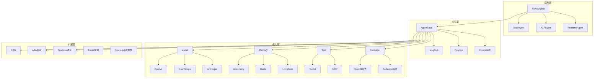

# 代码架构：AgentScope

## 整体架构概述

AgentScope采用**分层模块化架构**，整体分为三层：
1. **核心层（Core）**：提供Agent基类、消息系统、状态管理
2. **能力层（Capabilities）**：模型调用、记忆管理、工具集、格式化器
3. **扩展层（Extensions）**：RAG、MCP、A2A、实时语音、微调等高级功能

架构风格是**插件化 + 事件驱动**，通过MsgHub实现灵活的多智能体消息路由，通过Hooks机制支持扩展点。

## 架构图



## 模块划分

| 模块名 | 职责 | 对外接口 | 依赖模块 |
|--------|------|----------|----------|
| `agent` | 智能体实现 | `AgentBase`, `ReActAgent`, `UserAgent` | model, memory, tool, formatter |
| `model` | 模型API封装 | `ChatModelBase`, `DashScopeChatModel`, `OpenAIChatModel` | formatter |
| `memory` | 记忆管理 | `MemoryBase`, `InMemoryMemory`, `LongTermMemoryBase` | message |
| `tool` | 工具集管理 | `Toolkit`, `ToolResponse` | message, mcp |
| `message` | 消息定义 | `Msg`, `ContentBlock` | - |
| `formatter` | 消息格式化 | `FormatterBase` | message |
| `pipeline` | 工作流编排 | `MsgHub`, `sequential_pipeline` | agent |
| `mcp` | MCP协议支持 | `HttpStatelessClient`, `MCPToolFunction` | tool |
| `a2a` | A2A协议支持 | `AgentCardResolverBase` | agent |
| `rag` | 检索增强 | `KnowledgeBase`, `Document` | embedding |
| `realtime` | 实时语音 | `RealtimeBase`, 各类RealtimeModel | model |
| `tuner` | 模型微调 | 微调工作流相关 | model |

## 核心抽象与设计模式

### 核心类/接口

#### 1. AgentBase
- **职责**：所有智能体的抽象基类
- **关键方法**：`reply()`, `observe()`, `print()`, `interrupt()`
- **设计特点**：
  - 支持类级别和实例级别的Hooks
  - 内置消息广播机制（subscribers）
  - 支持流式输出和音频播放

#### 2. Msg（消息系统）
- **职责**：统一的消息格式
- **内容格式**：支持字符串或ContentBlock列表（text/image/audio/video/tool_use/tool_result）
- **特点**：支持元数据、时间戳、调用ID追踪

#### 3. Toolkit
- **职责**：工具函数注册、管理和执行
- **设计模式**：
  - **策略模式**：支持多种工具函数类型（同步/异步、流式/非流式）
  - **中间件模式**：支持中间件链
  - **动态扩展**：支持运行时注册/移除工具

#### 4. FormatterBase
- **职责**：将Msg格式化为不同模型API所需的格式
- **实现**：每种模型API有对应的Formatter（OpenAI、Anthropic、DashScope等）

### 使用的设计模式

| 设计模式 | 应用场景 |
|----------|----------|
| **模板方法模式** | `AgentBase.reply()` - 子类实现具体的回复逻辑 |
| **策略模式** | `FormatterBase` - 不同的格式化策略 |
| **观察者模式** | `MsgHub` - 消息广播给所有参与者 |
| **工厂模式** | `Toolkit` - 动态创建工具函数包装器 |
| **责任链模式** | Toolkit中间件 - 链式处理工具调用 |
| **状态模式** | `StateModule` - 管理智能体状态 |

## 外部集成

| 外部服务 | 用途 | 对接模块 | 协议/方式 |
|----------|------|----------|-----------|
| OpenAI API | GPT模型调用 | `model/_openai_model.py` | HTTP/REST |
| DashScope | 通义模型调用 | `model/_dashscope_model.py` | HTTP/REST |
| Anthropic | Claude模型调用 | `model/_anthropic_model.py` | HTTP/REST |
| MCP Server | 外部工具接入 | `mcp/` | MCP Protocol |
| Redis | 分布式记忆 | `memory/_working_memory/_redis_memory.py` | Redis协议 |
| Qdrant | 向量数据库 | `rag/_store/_qdrant_store.py` | HTTP/gRPC |
| Milvus | 向量数据库 | `rag/_store/_milvuslite_store.py` | HTTP/gRPC |
| OpenTelemetry | 可观测性 | `tracing/` | OTel协议 |

## 扩展点

### 1. Hooks机制
AgentBase提供了6种Hook点：
- `pre_reply` / `post_reply`：回复前后
- `pre_print` / `post_print`：打印前后
- `pre_observe` / `post_observe`：观察前后

支持类级别（所有实例）和实例级别的Hook注册。

### 2. 工具组（Tool Groups）
Toolkit支持将工具分组管理，可以动态激活/停用整组工具。

```python
toolkit.create_tool_group("web_search", description="Web search tools")
toolkit.update_tool_groups(["web_search"], active=True)
```

### 3. 自定义Agent
继承`AgentBase`或`ReActAgentBase`实现自定义智能体：

```python
class MyAgent(AgentBase):
    async def reply(self, msg):
        # 自定义回复逻辑
        pass
```

### 4. 自定义Formatter
继承`FormatterBase`支持新的模型API格式。

### 5. 自定义Memory
继承`MemoryBase`实现自定义记忆存储。

## 模块依赖方向

```
agent -> model, memory, tool, formatter, message
model -> formatter, message
tool -> message, mcp
memory -> message
formatter -> message
pipeline -> agent
rag -> embedding
mcp -> tool
```

所有模块都依赖于`message`模块。核心模块（agent、model、memory、tool、formatter）之间没有循环依赖。
